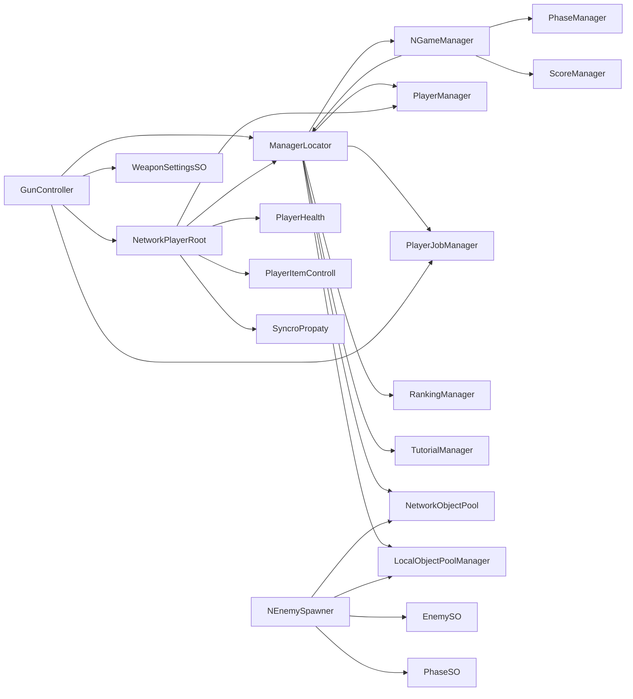
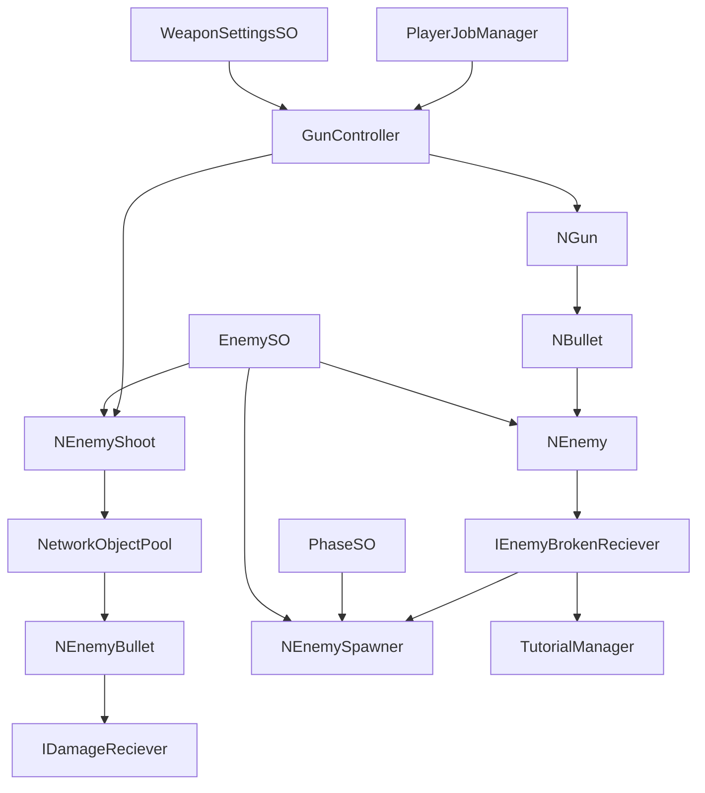
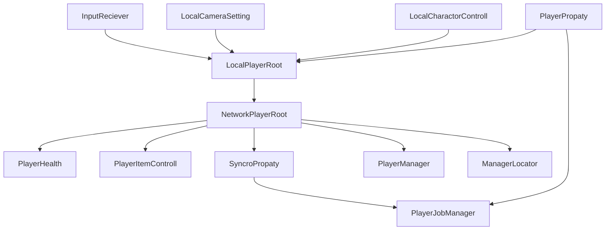
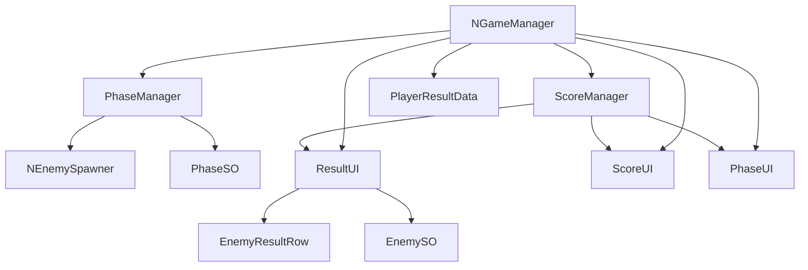

# BitSummitGameJam2026XR-2 スクリプト間参照関係

## 概要

このファイルは、`Assets` 配下の自作スクリプトについて、主要な参照関係を Mermaid で整理したものです。

対象:

- `Assets/BugMove/*`
- `Assets/Editor/*`
- `Assets/Scenes/*`
- `Assets/Script/*`

除外:

- `Assets/Samples/*`
- `Assets/TutorialInfo/*`
- `Assets/UnityChan/*`
- `Assets/VRTemplateAssets/*`
- `Assets/Supercyan Character Pack Zombie Sample/*`
- `Assets/Gunasset/*`

注意:

- 参照関係は主に型名ベースで整理しているため、実行時参照や Inspector 経由の参照は一部含まれません。
- 逆に、型名一致による緩い参照も一部混ざる可能性があります。
- そのため、ここでは「保守上の構造把握」に役立つ粒度へ要約しています。

## 全体構造

```mermaid
graph TD
    subgraph Core["コア管理"]
        ManagerLocator["ManagerLocator"]
        NGameManager["NGameManager"]
        ScoreManager["ScoreManager"]
        PhaseManager["PhaseManager"]
        RankingManager["RankingManager"]
        TutorialManager["TutorialManager"]
    end

    subgraph Player["プレイヤー / 入力"]
        LocalPlayerRoot["LocalPlayerRoot"]
        InputReciever["InputReciever"]
        LocalCameraSetting["LocalCameraSetting"]
        LocalCharactorControll["LocalCharactorControll"]
        NetworkPlayerRoot["NetworkPlayerRoot"]
        PlayerManager["PlayerManager"]
        PlayerHealth["PlayerHealth"]
        PlayerItemControll["PlayerItemControll"]
        SyncroPropaty["SyncroPropaty"]
        PlayerPropaty["PlayerPropaty"]
        PlayerJobManager["PlayerJobManager"]
    end

    subgraph Combat["武器 / 弾 / 敵"]
        GunController["GunController"]
        NGun["NGun"]
        BulletBaseController["BulletBaseController"]
        NBullet["NBullet"]
        NEnemy["NEnemy"]
        NEnemyShoot["NEnemyShoot"]
        NEnemySpawner["NEnemySpawner"]
        NetworkObjectPool["NetworkObjectPool"]
        LocalObjectPoolManager["LocalObjectPoolManager"]
        EnemySO["EnemySO"]
        PhaseSO["PhaseSO"]
    end

    subgraph UI["UI / 表示"]
        AmmoUI["AmmoUI"]
        PhaseUI["PhaseUI"]
        ScoreUI["ScoreUI"]
        ResultUI["ResultUI"]
        RoleButton["RoleButton"]
        StartButton["StartButton"]
        StatusViewer["StatusViewer"]
    end

    ManagerLocator --> NGameManager
    ManagerLocator --> PlayerManager
    ManagerLocator --> PlayerJobManager
    ManagerLocator --> NetworkObjectPool
    ManagerLocator --> LocalObjectPoolManager
    ManagerLocator --> RankingManager
    ManagerLocator --> TutorialManager

    LocalPlayerRoot --> InputReciever
    LocalPlayerRoot --> LocalCameraSetting
    LocalPlayerRoot --> LocalCharactorControll
    LocalPlayerRoot --> PlayerManager
    LocalPlayerRoot --> PlayerPropaty

    NetworkPlayerRoot --> PlayerHealth
    NetworkPlayerRoot --> PlayerItemControll
    NetworkPlayerRoot --> PlayerManager
    NetworkPlayerRoot --> PlayerStats["PlayerStats"]
    NetworkPlayerRoot --> SyncroPropaty
    NetworkPlayerRoot --> ManagerLocator

    GunController --> PlayerJobManager
    GunController --> WeaponSettingsSO["WeaponSettingsSO"]
    GunController --> NetworkPlayerRoot
    GunController --> ManagerLocator
    NGun --> GunController
    NGun --> AmmoUI
    NGun --> PlayerStats
    NGun --> PlayerPropaty

    BulletBaseController --> WeaponSettingsSO
    BulletBaseController --> IDamageReciever["IDamageReciever"]
    NBullet --> BulletBaseController
    NBullet --> NEnemy
    NBullet --> NetworkPlayerRoot
    NBullet --> PlayerPropaty
    NBullet --> ManagerLocator

    NEnemyShoot --> GunController
    NEnemyShoot --> EnemySO
    NEnemyShoot --> NetworkObjectPool
    NEnemyShoot --> ManagerLocator

    NEnemy --> EnemySO
    NEnemy --> PlayerHealth
    NEnemy --> NetworkPlayerRoot
    NEnemy --> ManagerLocator

    NEnemySpawner --> EnemySO
    NEnemySpawner --> PhaseSO
    NEnemySpawner --> NetworkObjectPool
    NEnemySpawner --> LocalObjectPoolManager

    PhaseManager --> NEnemySpawner
    PhaseManager --> PhaseSO
    PhaseManager --> ScoreManager
    NGameManager --> PhaseManager
    NGameManager --> ScoreManager

    PhaseUI --> NGameManager
    PhaseUI --> PhaseManager
    PhaseUI --> ScoreManager
    ScoreUI --> NGameManager
    ScoreUI --> ScoreManager
    ResultUI --> NGameManager
    ResultUI --> ScoreManager
    ResultUI --> EnemySO
    RoleButton --> NBullet
    RoleButton --> PlayerPropaty
    StartButton --> LocalPlayerRoot
    StatusViewer --> LocalPlayerRoot
```

## 主要ハブ

## 戦闘フロー

## プレイヤーとネットワーク同期

## UI とゲーム進行

## 問題になりやすい結合ポイント

### 1. `ManagerLocator` に依存が集中している

`ManagerLocator` は次のような複数責務の参照集約点になっています。

- ゲーム進行
- プレイヤー管理
- オブジェクトプール
- ランキング
- チュートリアル
- オーディオ

この形は短期的には便利ですが、参照方向が中央集権化しやすく、変更影響が読みにくくなります。

### 2. `GunController` が多責務

`GunController` は、次をまたいでいます。

- 武器設定
- UI 更新
- 弾生成
- サウンド通知
- プレイヤー状態
- ジョブ設定

武器ロジックの中に、表示やプレイヤー文脈まで入ってきているため、再利用しづらい構造です。

### 3. `NetworkPlayerRoot` と `LocalPlayerRoot` の責務境界が曖昧

ローカル入力、ローカルカメラ、ネットワーク同期、プレイヤー状態が近い場所で混ざっています。

結果として、

- ローカル専用の変更
- ネットワーク同期の変更
- XR 入力の変更

が互いに影響しやすくなっています。

### 4. `NEnemySpawner` がスポーン設定と通知先を抱え込んでいる

`NEnemySpawner` は、

- `EnemySO`
- `PhaseSO`
- `NetworkObjectPool`
- `LocalObjectPoolManager`
- `IEnemyBrokenReciever`

にまたがっており、スポーン制御、フェーズ進行、死亡通知の責務が密です。

### 5. UI がゲームマネージャーへ直接寄っている

`PhaseUI`、`ScoreUI`、`ResultUI` が `NGameManager` / `ScoreManager` / `PhaseManager` に直接近いので、UI 差し替えやテストの単位が大きくなっています。

## 改善案

## 改善案 1: `ManagerLocator` を用途別の参照口に分割する

現状:

- `ManagerLocator` が何でも持つ

改善:

- `GameplayServices`
- `PlayerServices`
- `AudioServices`
- `UIContext`

のように分ける

効果:

- 依存の向きが読みやすくなる
- 不要な参照を渡さなくて済む
- テスト用差し替えがしやすくなる

## 改善案 2: `GunController` を分解する

分離候補:

- `GunState`
- `GunShooter`
- `GunAmmoPresenter`
- `GunAudioEmitter`
- `GunConfigResolver`

効果:

- 武器挙動の変更が UI や音に波及しにくい
- 敵武器とプレイヤー武器で共通化しやすい
- `NGun` / `NEnemyShoot` の責務が薄くなる

## 改善案 3: ローカル入力層とネットワーク同期層を明確に分ける

分け方の例:

- `LocalPlayerRoot`: 入力、XR カメラ、手元制御
- `NetworkPlayerRoot`: 同期対象の状態
- `PlayerPresentation`: 見た目
- `PlayerRuntimeContext`: ジョブ、体力、現在武器

効果:

- XR 周りの変更がネットワーク同期へ漏れにくい
- プレイヤー同期のデバッグがしやすい

## 改善案 4: スポーン管理をフェーズ管理から疎結合にする

現状:

- `PhaseManager` が `NEnemySpawner` を直接知っている

改善:

- フェーズ開始時に `SpawnPlan` を発行
- `NEnemySpawner` は `SpawnPlan` を受けて処理

効果:

- スポーン方式の差し替えがしやすい
- 将来的にボス戦、イベント戦、ウェーブ差分を追加しやすい

## 改善案 5: UI をイベント購読型へ寄せる

現状:

- UI がマネージャー参照に近い

改善:

- `ScoreChanged`
- `PhaseChanged`
- `ResultReady`
- `AmmoChanged`

のようなイベントを購読して更新する

効果:

- UI の差し替えが容易
- UI テストがしやすい
- マネージャーの public 参照を減らせる

## 改善案 6: 旧構成と新構成の分離を進める

`Scenes/SystemScene/*` と `Scenes/NSystemScene/*` に似た責務のスクリプトが並存しています。

例:

- `Gun` と `NGun`
- `Enemy` と `NEnemy`
- `GameManager` と `NGameManager`
- `EnemySpawner` と `NEnemySpawner`

改善:

- 旧実装を `Legacy` フォルダへ隔離する
- まだ使うなら README に現役/非現役を明記する
- 使わないなら段階的に削除する

効果:

- 参照探索時のノイズが減る
- 誤参照や重複実装の混入を防げる

## 次にやると効果が大きい順

1. `ManagerLocator` の分割方針を決める
2. `GunController` の責務を分解する
3. `LocalPlayerRoot` と `NetworkPlayerRoot` の境界を整理する
4. UI をイベント購読型へ寄せる
5. `SystemScene` 系の旧スクリプトを隔離する
